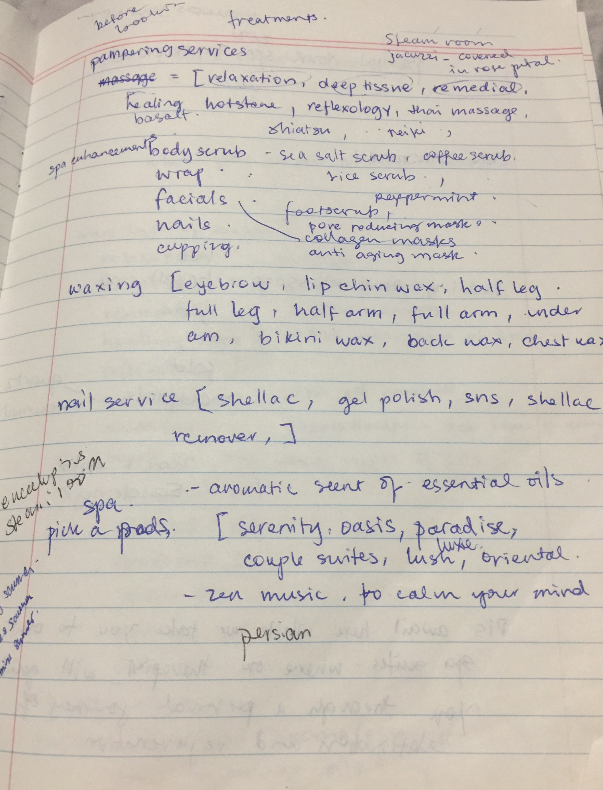

# Terminal App - Zen Sanctuary
#####BRAINSTORMING / PLANNING

Heres a few screen shots of my ideas for this app and used trello to manage my workflow. Using just simple structure;
To Do
Work In progress
Review
Completed

####STATEMENT OF PURPOSE

Zen Sanctuary is a massage spa that offers a mind, body and soul experience to help your body relax, balance and destress. It offers a holistic massage therapies tailored to suit your individual needs with highly experienced qualified therapists.

The Zen app is designed for customers to guide them through an ordering process for their chosen treatment. There will be a computerised screen upon entering the salon which allows the customer to order ahead without having to queue in line and waiting to be served. The screen displays a welcome note and ask the customer for their name 

This helps the customer by ordering ahead if theres a queue at the counter and user can sit back and wait to be called in to start their treatment. 

This also helps the shop to be more efficient in serving their customers. 

Zen Sanctuary is primarily set in the urban Melbourne area.  With todays technology of the Internet and through social media, Zen Sanctuary  can reach and serve to more people, inner melbourne and nearby suburbs.

####FEATURES, USER INTERACTION AND EXPERIENCE:

In current version 1.0, there are four main features which are;
Simple interactive menu system
Displays all available treatment/services
View all selected treatment 
Saves selections into a file, accessible by receptionist/therapist

The application is interactive where it ask user for their name and greets them with a welcome message. The app also displays the treatments that are available and user can select their preferred treatment. It further ask for upgrades where they can choose one or more items. After choosing all available options the app will display all the selections the user have selected. This selection is saved to a file and can be viewed by the receptionist and therapist.

| Feature | Task | Priority | Deadline |
| ---------------------------------------| ---------------------------------------| -------- | ---------- |
|Display: Welcome message | User: input name                      | 1       | 14/11/2019 |
|  | Display Greeting message with user's name                   | 4        | 14/11/2019 |                         | Add gems tty-box and tty-font         | 3        | 14/11/2019 |
|                        | Testing code                          | 5        | 14/11/2019 |
| Display: Massage types selection| Create selection using gem tty-prompt| 1| 15/11/2019 ||
|                        | Display user's selection              | 2        | 15/11/2019 ||
|                                       | Add gem tty-prompt                    | 5        | 15/11/2019 |
|                                       | Testing Code                          | 6        | 15/11/2019 |
| Display: Oil type selection           | User select type of oil they want     | 1        | 15/11/2019 |
|                                       | Display user's oil selection          | 2        | 15/11/2019 |
|                                       | Interpolate user's selection and display success message | 3        | 15/11/2019 |
|                                       | Add gem tty-prompt                    | 5        | 16/11/2019 |
|                                       | Testing Code                          | 6        | 16/11/2019 |
| Display : Add Ons               | Create multi select options             | 1        | 16/11/2019 |
|                                       | Load add ons for upgrade              | 1        | 16/11/2019 |
|                                       | Create loop for add ons               | 6        | 15/11/2019 |
|                                       | Add gem: tty-prompt,colorize          | 4        | 15/11/2019 |
| Error handling                        | Add error handling                    | 1        | 17/11/2019 |
| Documentation                         | create software development plan,readme, devlog,           | 2        | 17/11/2019 |
|                                       | help file, script, build.sh           | 2        | 17/11/2019 |
| Presentation                          |                                       | 1        | 21/11/2019 |

####CONTROL FLOW DIAGRAM

#####IMPLEMENT APPLICATION

SOFTWARE DEVELOPMENT PLAN

1.User Input Details:

First of all user will  prompted to a box in a terminal emulator with below output messages

###### │Welcome to Zen Sanctuary│

To help direct you to our menu system, may I begin with your name please?
Then user will be asked to input his/her name.
Pleasure to have you here today Bree! Please select your preferred massage type from the following options.
You have chosen relaxation

2. massage_selection() is main method

           There is called on based on different cases available in massage_therapy array. It is further divided into 2 parts

A. relaxation, deep tissue, remedial, swedish, shiatsu, aromatherapy
B. thai massage

3. A Case: massage_selection = "relaxation", "deep tissue", "remedial", "swedish",       " "shiatsu", "aromatherapy"

For example you have selected “relaxation”

 In next line you will be asked  to choose oil 

Now let's choose a massage oil for your session today

For example you have selected “coconut oil” so variable 
oil_selection = “coconut oil”

On next line you will see below text message using colorize gem.

Great Aubrey! you have selected coconut oil with your relaxation massage
Now would you like to add an upgrade? Please enter Y or N

If you enter ’Y’ then select_add_ons method will be called with arguments

select_add_ons(["body scrub", "facials", "cupping", "hotstone", "reflexology"], prompt)

and exit_method(massage_add_ons, massage_selection, oil_selection) will be returned.

else If you enter ’N’ then exit_method method will be called with arguments

exit_method([],"relaxation", “coconut oil”)

B Case: massage_selection = "thai massage"

On next line you will see below text message  with colors.

No oils required for thai massage
Now would you like to add an upgrade? Please enter Y or N

If you enter ’Y’ then select_add_ons method will be called with arguments

select_add_ons(["body scrub", "facials", "cupping", "hotstone", "reflexology"], prompt)

and exit_method(massage_add_ons, massage_selection, oil_selection) will be returned.

else If you enter ’N’ then user will see below message

You have chosen no upgrades for your thai massage.

At end of program user will be see below message.

Your treatment for today: #{massage_selection}. Please take a seat to our lounge area and help yourself to a complimentary tea while we get your room ready

4. select_add_ons()
continue = true
           In this method user can select multiple adons. All user selected addons are placed once in more_add_ons array. Then use will be prompted with a below message

Would you like to select another upgrade? Y or N ?

If you enter “Y” then continue = true to select more adons. 
If you enter “N” then while loop with exit and selected add_ons list will be returned otherwise continue = true to select more adons.

5. exit_method()

If user has selected any addons then user will see below messageg
               Your treatment for today is #{massage_selection} with #{oil_selection} with         #{massage_add_ons}. Please take a seat to our lounge area and help yourself to a complimentary tea while we print your order  and get your room ready

If user has not selected any addons then user will see below message
Your treatment for today is #{massage_selection} with #{oil_selection}. Please wait one while we get your room ready

At the end of exit_method save_to_file method will be called to save output to a file treatment.txt

6. save_to_file()

            In this method selected inputs are saved in a string variable called user_selections and then loops through add_ons and puts all items in massage_add_ons empty array. User_selections are saved in a newly created file treatment.txt. 

There are following below 4 arrays.

massage_therapy = ["relaxation", "deep tissue", "remedial", "swedish", "shiatsu", "aromatherapy", "thai massage"]
massage_oils = ["coconut oil", "avocado oil", "grapeseed oil", "jojoba oil", "apricot oil"]
add_ons = ["body scrub", "facials", "cupping", "hotstone", "reflexology"]
Massage_add_ons = []

By: Aubreyleen Gamboa

